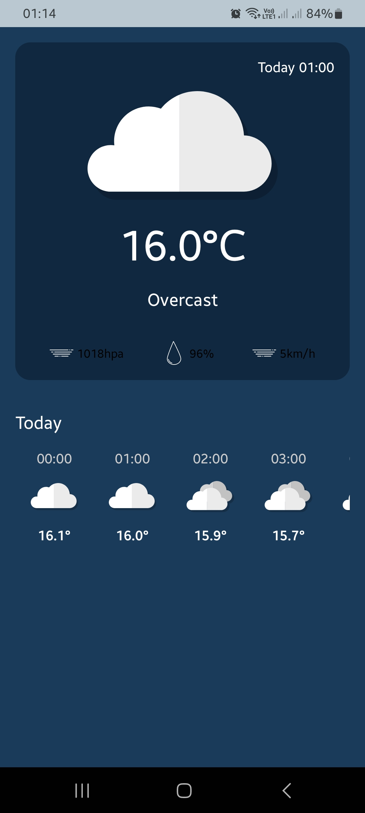

Weather App
===========
This is a simple weather app built with jetpack compose, and  made use of the weather api.

## Features
- Get the current weather of the city
- Get the forecast of the city
- Get the weather of the city for the next 7 days
- Get the weather of the city for the next 24 hours

## Screenshots

## Libraries Used
- [Jetpack Compose](https://developer.android.com/jetpack/compose) - A modern toolkit for building native Android UI.
- [Retrofit](https://square.github.io/retrofit/) - A type-safe HTTP client for Android and Java.
- [Coil](https://coil-kt.github.io/coil/compose/) - An image loading library for Android backed by Kotlin Coroutines.
- [Hilt](https://dagger.dev/hilt/) - A dependency injection library for Android that reduces the boilerplate of doing manual dependency injection in your project.
- [Coroutines](https://kotlinlang.org/docs/coroutines-overview.html) - A coroutine is a concurrency design pattern that you can use on Android to simplify code that executes asynchronously.
- [Flow](https://kotlinlang.org/docs/flow.html) - A flow is an asynchronous version of a Sequence, a type of collection whose values are lazily produced.
